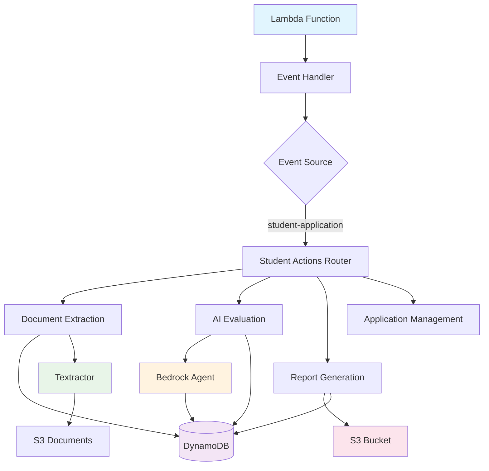
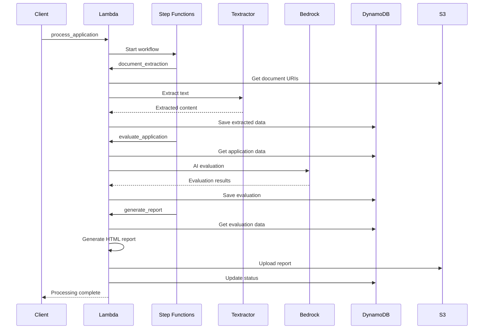
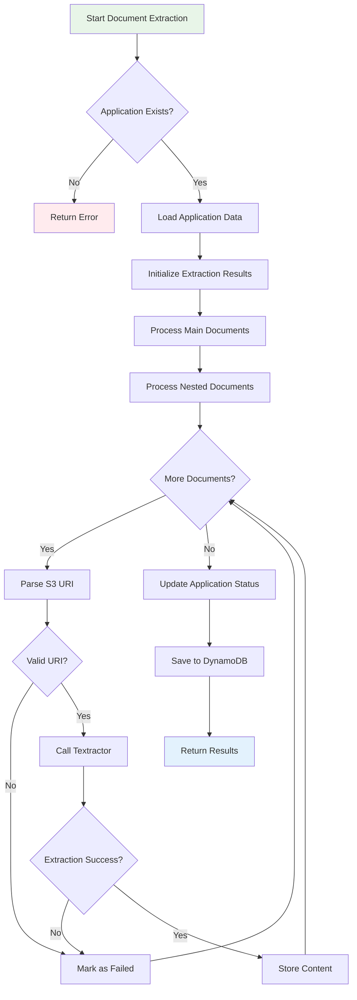
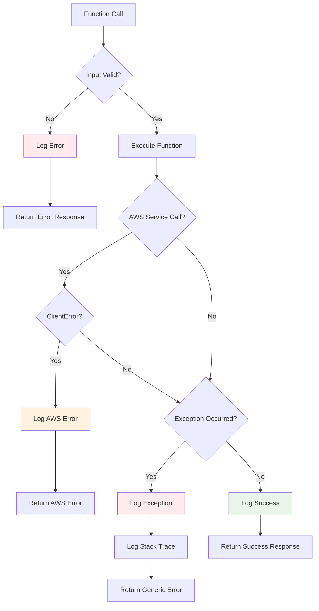
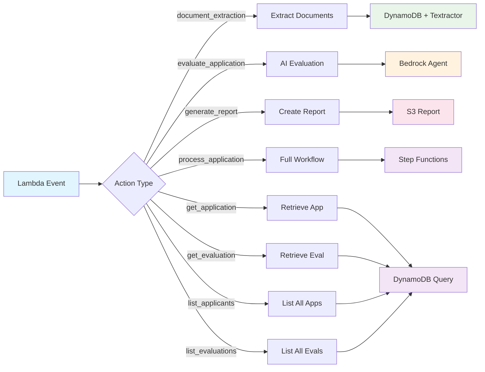
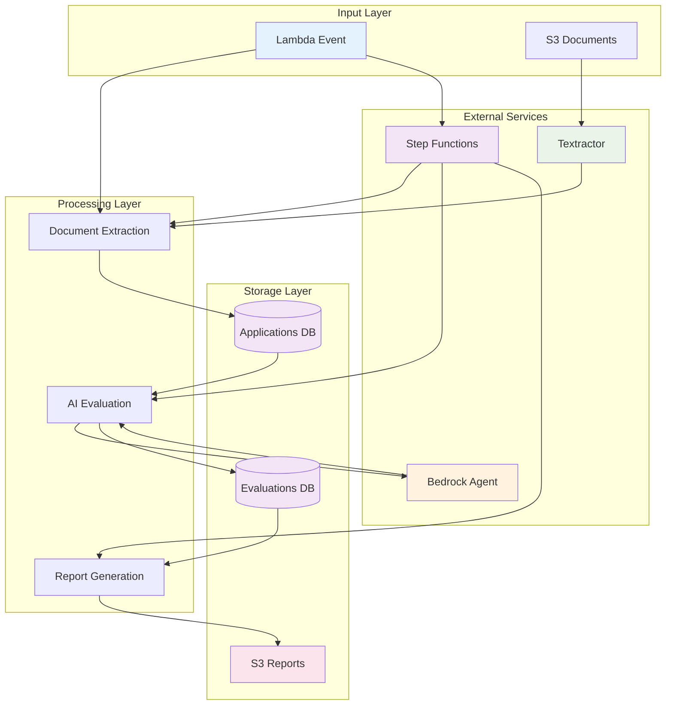
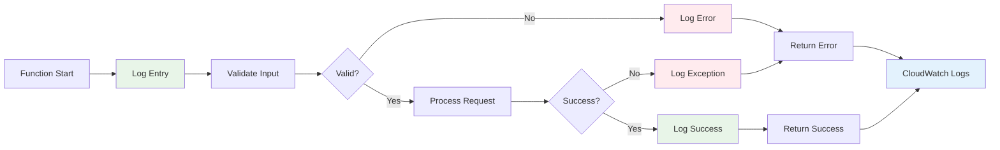
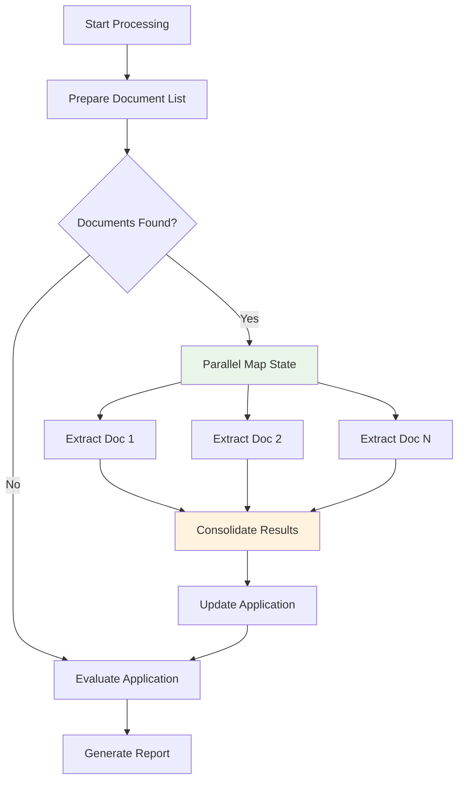

# University Application Processing System

A Lambda-based system for processing university applications with document extraction, AI evaluation, and report generation.

## System Architecture



## Application Processing Flow



## Document Extraction Workflow



## Error Handling Flow



## Components

### Core Files
- `lambda_function.py` - Main Lambda handler
- `student_application.py` - Application processing logic
- `aws_utils.py` - AWS service integrations
- `config.py` - Configuration management
- `utils.py` - Helper utilities
- `report_generation.py` - HTML report generator

## Configuration Details

### Required AWS Resources
```yaml
AWS:
  region_name: us-east-1

AGENTS:
  uni_application_analyst:
    agentcore_arn: arn:aws:bedrock-agentcore:us-east-1:ACCOUNT:runtime/uni_application_analyst-ID
    qualifier: DEFAULT

DYNAMO_DB:
  application_table_name: UA-applications      # Stores application data + extracted content
  evaluations_table_name: uni-applications-evaluated  # Stores AI evaluation results

REPORTS:
  save_bucket: your-s3-bucket
  save_key: university_app/reports

PROCESS:
  application_processing_sm: arn:aws:states:REGION:ACCOUNT:stateMachine:uni-application-processing-v2
  application_processing_parallel_sm: arn:aws:states:REGION:ACCOUNT:stateMachine:uni-application-processing-parallel
  max_parallel_documents: 10
```

### DynamoDB Table Structures

**UA-applications Table:**
- Primary Key: `application_id`
- Contains: Application metadata, extracted document content, processing status
- Updated by: Document extraction, status tracking

**uni-applications-evaluated Table:**
- Primary Key: `application_id` 
- Contains: AI evaluation results (level1-4), scores, decisions
- Updated by: AgentCore evaluation, report generation

### IAM Permissions Required
- DynamoDB: Read/Write access to both tables
- S3: Read documents, Write reports
- Textractor: Document analysis
- Bedrock: Agent runtime invocation
- Step Functions: State machine execution

## Action Flow Diagram



## Data Flow Architecture



## Monitoring & Logging Flow



## Supported Actions

| Action | Description |
|--------|-------------|
| `document_extraction` | Extract text from S3 documents (legacy serial) |
| `prepare_document_list` | Prepare documents for parallel processing |
| `extract_single_document` | Extract individual document content |
| `consolidate_extraction_results` | Merge parallel extraction results |
| `evaluate_application` | AI-powered application analysis |
| `generate_report` | Create comprehensive HTML reports |
| `process_application` | Full workflow via Step Functions (uses parallel processing) |
| `get_application` | Retrieve application data |
| `get_evaluation` | Retrieve evaluation results |
| `list_applicants` | Get all applications |
| `list_evaluations` | Get all evaluations |

## Event Format

```json
{
  "Records": [{
    "eventSource": "student-application",
    "action": "document_extraction",
    "input": {
      "application_id": "APP123"
    }
  }]
}
```

## AgentCore Integration

### AI Evaluation Engine
The system uses **Bedrock AgentCore Runtime** for intelligent application analysis:

**Agent Configuration:**
- **Agent**: `uni_application_analyst` 
- **ARN**: `arn:aws:bedrock-agentcore:us-east-1:040504913362:runtime/uni_application_analyst-02lJA42ORV`
- **Purpose**: Multi-level application evaluation (Level 1-4 analysis)

**Data Flow:**
```
UA-applications → AgentCore Analysis → uni-applications-evaluated
```

**Evaluation Structure:**
- **Level 1**: Eligibility & Prerequisites
- **Level 2**: Academic Performance & Test Scores  
- **Level 3**: Holistic Assessment (SOP, LOR, Research)
- **Level 4**: Final Decision & Composite Scoring

**Integration Points:**
- Input: Complete application data (documents + metadata)
- Processing: AI-powered multi-criteria evaluation
- Output: Structured scores, decisions, and recommendations

## Setup

1. Deploy Lambda function with required IAM permissions
2. Configure `config.yaml` with your AWS resources
3. Install dependencies: `pip install -r requirements.txt`

## Error Handling Features

- ✅ Comprehensive logging to CloudWatch
- ✅ Input validation and sanitization
- ✅ AWS service error handling
- ✅ Graceful failure recovery
- ✅ Detailed error responses
- ✅ Stack trace logging for debugging
- ✅ Type hints and documentation

## Monitoring

Check CloudWatch logs for:
- Function execution details
- Error traces and debugging info
- Performance metrics
- AWS service call results

### Performance Metrics
- **Document Extraction**: ~2-5 seconds per document (serial), ~30 seconds for 10 documents (parallel)
- **AI Evaluation**: ~10-15 seconds per application
- **Report Generation**: ~5-10 seconds (with pagination)
- **Memory Usage**: ~512MB typical, up to 1GB for large reports

### Troubleshooting

**Common Issues:**
1. **Lambda Timeout**: Reduce report cohort size or increase timeout
2. **Memory Errors**: Enable pagination in report generation
3. **Status Conflicts**: Check for concurrent processing
4. **AgentCore Failures**: Validate input data structure

**Debug Commands:**
```bash
# Check application status
aws dynamodb get-item --table-name UA-applications --key '{"application_id":{"S":"APP123"}}'

# Check evaluation results  
aws dynamodb get-item --table-name uni-applications-evaluated --key '{"application_id":{"S":"APP123"}}'

# Check Step Function execution
aws stepfunctions describe-execution --execution-arn <execution-arn>
```

## Parallel Document Processing

The system now supports optimized parallel document processing using AWS Step Functions Map state:

### Benefits
- **10x faster processing** - Documents processed concurrently instead of serially
- **Configurable concurrency** - Up to 10 parallel executions by default
- **Same data format** - Results stored in identical format as before
- **Error isolation** - Individual document failures don't stop the entire process

### Parallel Processing Flow



### Deployment Status
✅ **DEPLOYED** - Parallel processing is now active!
- Step Function: `uni-application-processing-parallel`
- ARN: `arn:aws:states:us-east-1:040504913362:stateMachine:uni-application-processing-parallel`
- Max Concurrency: 10 documents

### New Actions Added
- `prepare_document_list` - Prepares documents for parallel processing
- `extract_single_document` - Extracts individual document content
- `consolidate_extraction_results` - Merges parallel results back to application

### Usage
The system automatically uses parallel processing when calling `process_application`. No changes needed to existing API calls.

```
lambdafun/
├── lambda_function.py          # Main Lambda handler
├── student_application.py      # Core application logic
├── aws_utils.py               # AWS service utilities
├── report_generation.py       # HTML report generator
├── config.py                  # Configuration loader
├── utils.py                   # Helper utilities
├── config.yaml               # AWS resource configuration
├── requirements.txt          # Python dependencies
├── step-function-parallel.json # Parallel Step Function definition
├── deploy-step-function.py    # Step Function deployment script
├── README.md                 # This documentation
└── IMPROVEMENTS_SUMMARY.md   # Code improvement details
```
