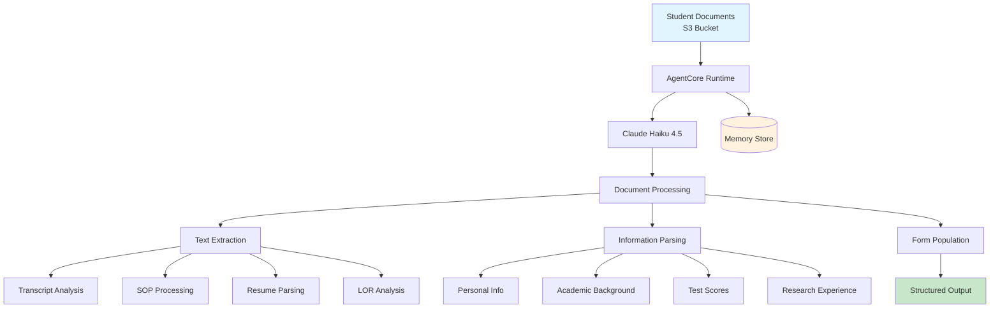
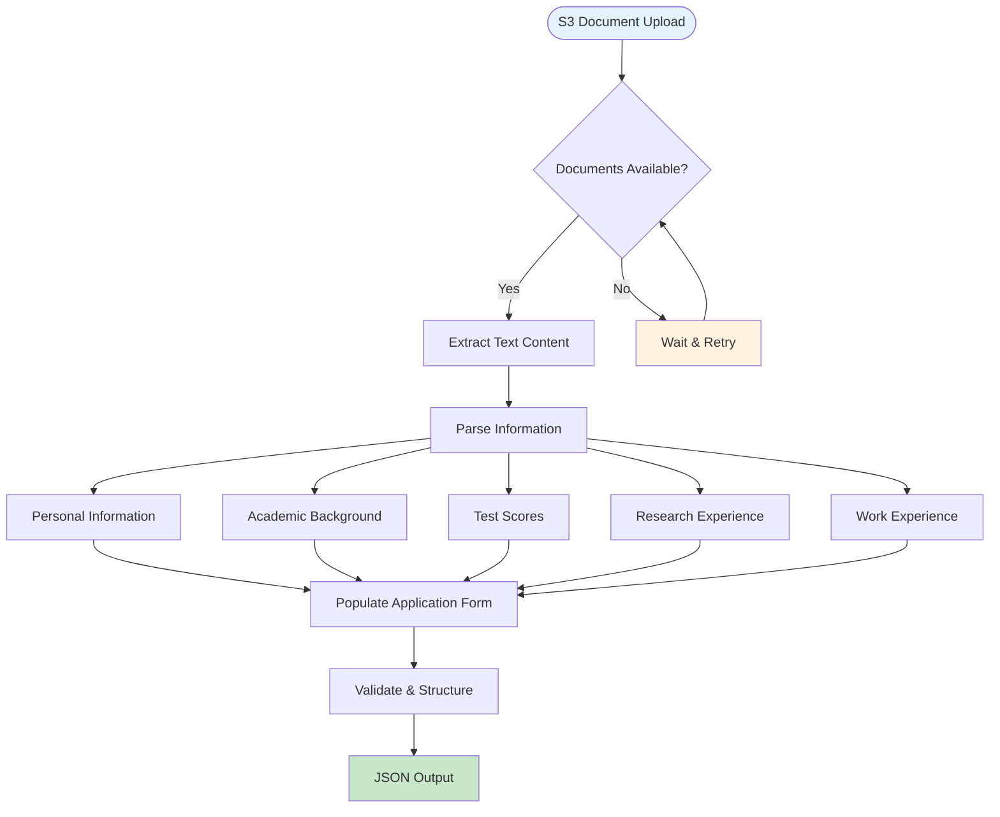
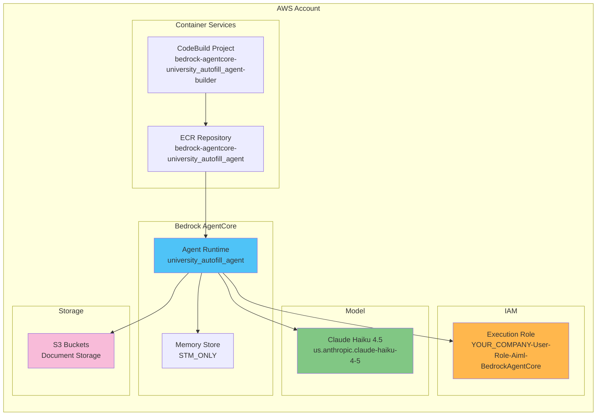
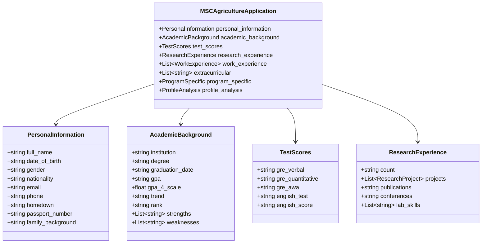

# University Application Autofill AgentCore

AI-powered document processing system that extracts information from student application documents and automatically fills university application forms using AWS Bedrock AgentCore.

## System Architecture



## Document Processing Flow



## AWS Infrastructure



## Data Models Structure



## Supported Documents

The system processes the following document types from S3:

| **Document Type** | **Purpose** | **Information Extracted** |
|-------------------|-------------|---------------------------|
| **transcript** | Academic records | GPA, courses, grades, institution |
| **sop** | Statement of Purpose | Research interests, career goals |
| **resume** | Professional background | Work experience, skills |
| **lor_academic** | Academic recommendation | Academic performance insights |
| **lor_research** | Research recommendation | Research capabilities |
| **lor_professional** | Professional recommendation | Work performance |
| **passport** | Identity verification | Personal details, nationality |
| **gre_report** | Standardized test scores | GRE verbal, quantitative, AWA |
| **english_report** | Language proficiency | TOEFL/IELTS/PTE scores |
| **degree_certificate** | Degree verification | Graduation details |
| **bank_statement** | Financial capability | Financial background |
| **affidavit** | Legal declarations | Supporting statements |
| **fee_receipt** | Payment confirmation | Application fee payment |

## Quick Start

### Deploy
```bash
python deploy.py
```

### Test
```bash
python test.py                # Basic functionality test
python test_runner.py         # Comprehensive test suite
```

### Monitor
```bash
python health_check.py        # Validate deployment
python monitor.py             # Performance metrics
```

### Cleanup
```bash
python cleanup.py             # Remove all resources
```

## Configuration

### Environment Setup

1. **Copy environment template:**
```bash
cp .env.template .env
```

2. **Update `.env` with your values:**
```bash
AWS_REGION=us-east-1
AWS_ACCOUNT_ID=your-account-id
AGENT_ID=university_autofill_agent-your-agent-id
MEMORY_ID=university_autofill_agent_mem-your-memory-id
```

### Agent Configuration

Configuration is centralized in `config.py` and can be overridden via environment variables:

```python
# AWS Configuration
AWS_REGION = os.getenv('AWS_REGION', 'us-east-1')
AWS_ACCOUNT_ID = os.getenv('AWS_ACCOUNT_ID', 'your-account-id')

# Bedrock Model
BEDROCK_MODEL_ID = "us.anthropic.claude-haiku-4-5-20251001-v1:0"

# Agent Settings
AGENT_NAME = "university_autofill_agent"
MEMORY_MODE = "STM_ONLY"
```

### Bedrock AgentCore YAML

The `.bedrock_agentcore.yaml` is auto-generated during deployment based on `config.py` values.

## File Structure

```
agentcore/
├── 📄 university-autofill-agent.py  # Main agent entrypoint
├── 🔧 tools/
│   └── student_form.py              # Pydantic data models
├── 📝 prompts/
│   └── application_form.json        # Application form template
├── 🧪 test_case/
│   └── sample_application.json      # Test data
├── 🛠️ utils/
│   └── utils.py                     # S3 document processing utilities
├── ⚙️ .bedrock_agentcore.yaml       # Agent configuration
├── 🐳 Dockerfile                    # Container definition
├── 📋 requirements.txt              # Python dependencies
├── 🚀 deploy.py                     # Deployment automation
├── 🔍 test.py                       # Basic testing
├── 🧪 test_runner.py                # Comprehensive tests
├── 💊 health_check.py               # System validation
├── 📊 monitor.py                    # Performance monitoring
└── 🧹 cleanup.py                    # Resource cleanup
```

## Sample Input/Output

### Input Payload
```json
{
  "s3_bucket_name": "your-documents-bucket",
  "s3_key": "student-documents/john-doe/"
}
```

### Output Response
```json
{
  "personal_information": {
    "full_name": "John Doe",
    "email": "john.doe@email.com",
    "phone": "+1-555-0123",
    "nationality": "American",
    "date_of_birth": "2001-05-15"
  },
  "academic_background": {
    "institution": "State University",
    "degree": "B.Sc. Agriculture",
    "gpa": "8.2/10.0",
    "gpa_4_scale": 3.28,
    "graduation_date": "2024-05-15"
  },
  "test_scores": {
    "gre_verbal": "155",
    "gre_quantitative": "160",
    "gre_awa": "4.0",
    "english_test": "IELTS",
    "english_score": "7.5"
  },
  "research_experience": {
    "count": "1",
    "projects": [
      {
        "title": "Sustainable Crop Production",
        "duration": "8 months",
        "role": "Primary Researcher"
      }
    ],
    "lab_skills": ["Soil analysis", "Plant breeding"]
  },
  "documents": {
    "transcript": "s3://your-documents-bucket/student-documents/john-doe/transcript.pdf",
    "sop": "s3://your-documents-bucket/student-documents/john-doe/sop.pdf",
    "resume": "s3://your-documents-bucket/student-documents/john-doe/resume.pdf"
  }
}
```

## Usage

The agent processes student documents from S3 and extracts structured information to automatically populate university application forms. It accepts S3 bucket and key parameters, reads the uploaded documents, and returns a complete MSc Agriculture application form in JSON format.
