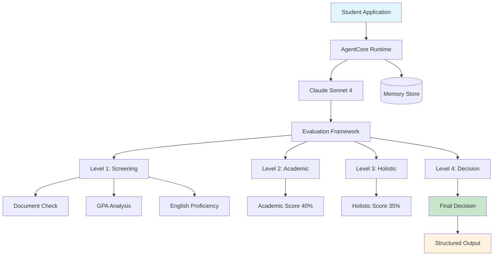
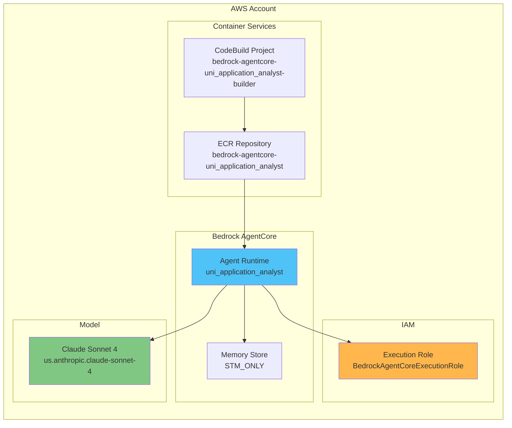
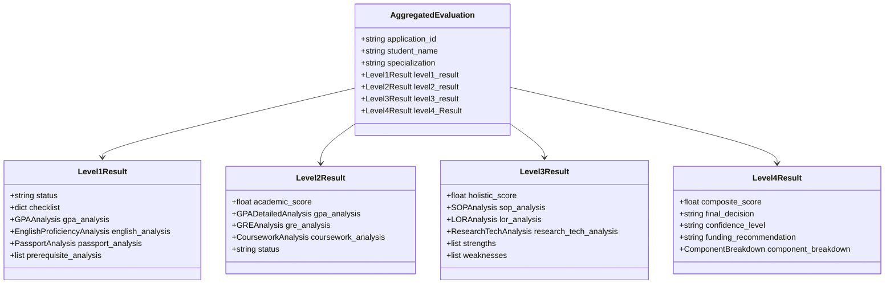

# University Application Analyst AgentCore

AI-powered university admissions evaluation system using AWS Bedrock AgentCore.

## System Architecture



## Evaluation Framework Flow

```mermaid
flowchart TD
    Start([Application Input]) --> L1{Level 1: Eligibility}
    
    L1 -->|PASS| L2[Level 2: Academic Evaluation]
    L1 -->|FAIL| Reject[❌ Reject]
    L1 -->|INCOMPLETE| Request[📋 Request Documents]
    
    L2 --> L2_GPA[GPA Analysis<br/>50% weight]
    L2 --> L2_GRE[GRE Scores<br/>35% weight]
    L2 --> L2_Course[Coursework<br/>15% weight]
    
    L2_GPA --> L3[Level 3: Holistic Review]
    L2_GRE --> L3
    L2_Course --> L3
    
    L3 --> L3_SOP[Statement of Purpose<br/>30% weight]
    L3 --> L3_LOR[Letters of Recommendation<br/>40% weight]
    L3 --> L3_Research[Research Experience<br/>30% weight]
    
    L3_SOP --> L4[Level 4: Final Decision]
    L3_LOR --> L4
    L3_Research --> L4
    
    L4 --> Decision{Composite Score}
    Decision -->|≥80| Accept[✅ Accept]
    Decision -->|60-79| Waitlist[⏳ Waitlist]
    Decision -->|<60| Reject2[❌ Reject]
    
    Accept --> Funding[💰 Funding Recommendation]
    Waitlist --> Conditional[📝 Conditional Offer]
    
    style Start fill:#e3f2fd
    style Accept fill:#c8e6c9
    style Waitlist fill:#fff3e0
    style Reject fill:#ffcdd2
    style Reject2 fill:#ffcdd2
```



## AWS Infrastructure



## Data Models Structure



## Scoring Breakdown

| **Level** | **Component** | **Weight** | **Max Score** |
|-----------|---------------|------------|---------------|
| **Level 2** | GPA Analysis | 50% | 50 points |
| | GRE Scores | 35% | 35 points |
| | Coursework Depth | 15% | 15 points |
| **Level 3** | Statement of Purpose | 30% | 30 points |
| | Letters of Recommendation | 40% | 40 points |
| | Research Experience | 30% | 30 points |
| **Level 4** | Academic (Level 2) | 40% | 40 points |
| | Holistic (Level 3) | 35% | 35 points |
| | Program Fit | 15% | 15 points |
| | Potential | 10% | 10 points |

## Decision Matrix

| **Score Range** | **Decision** | **Funding** | **Action** |
|-----------------|--------------|-------------|------------|
| 85-100 | ✅ **Accept** | Full Assistantship | Send offer letter |
| 75-84 | ✅ **Accept** | Partial Assistantship | Send offer letter |
| 65-74 | ⏳ **Waitlist** | Conditional | Monitor for openings |
| 55-64 | ⏳ **Waitlist** | Self-funded | Consider if space available |
| < 55 | ❌ **Reject** | None | Send rejection letter |

## Quick Start

### Setup
```bash
python setup.py                  # Interactive configuration
```

### Deploy
```bash
python deploy.py
```

### Test
```bash
python test.py                # Basic functionality test
python test_runner.py         # Comprehensive test suite
```

### Monitor
```bash
python health_check.py        # Validate deployment
python monitor.py             # Performance metrics
```

### Cleanup
```bash
python cleanup.py             # Remove all resources
```

## Configuration

### Environment Setup

1. **Copy environment template:**
```bash
cp .env.template .env
```

2. **Update `.env` with your values:**
```bash
AWS_REGION=us-east-1
AWS_ACCOUNT_ID=YOUR_AWS_ACCOUNT_ID
AGENT_ID=uni_application_analyst-YOUR_AGENT_ID
MEMORY_ID=uni_application_analyst_mem-YOUR_MEMORY_ID
```

### Agent Configuration

Configuration is centralized in `config.py` and can be overridden via environment variables:

```python
# AWS Configuration
AWS_REGION = os.getenv('AWS_REGION', 'us-east-1')
AWS_ACCOUNT_ID = os.getenv('AWS_ACCOUNT_ID', 'YOUR_AWS_ACCOUNT_ID')

# Bedrock Model
BEDROCK_MODEL_ID = "us.anthropic.claude-sonnet-4-20250514-v1:0"

# Agent Settings
AGENT_NAME = "uni_application_analyst"
MEMORY_MODE = "STM_ONLY"
```

### Bedrock AgentCore YAML

The `.bedrock_agentcore.yaml` is auto-generated during deployment based on `config.py` values.

## File Structure

```
agentcore/
├── 📄 uni-application-analyst.py    # Main agent entrypoint
├── 🔧 tools/
│   └── eval_framework.py            # Pydantic evaluation models
├── 📝 prompts/
│   ├── program_details.txt          # M.Ag.Sc program information
│   └── evaluation_framework.txt     # Assessment criteria
├── 🧪 test_case/
│   └── sample_application.json      # Test data
├── ⚙️ .bedrock_agentcore.yaml       # Agent configuration
├── 🐳 Dockerfile                    # Container definition
├── 📋 requirements.txt              # Python dependencies
├── 🚀 deploy.py                     # Deployment automation
├── 🔍 test.py                       # Basic testing
├── 🧪 test_runner.py                # Comprehensive tests
├── 💊 health_check.py               # System validation
├── 📊 monitor.py                    # Performance monitoring
└── 🧹 cleanup.py                    # Resource cleanup
```

## Sample Output

```json
{
  "application_id": "AGR-2025-009",
  "student_name": "Deepika Iyer",
  "specialization": "Food Science",
  "level4_Result": {
    "composite_score": 71.8,
    "final_decision": "WAITLIST",
    "confidence_level": "MEDIUM",
    "funding_recommendation": "Partial Assistantship",
    "strengths": [
      "Exceptional program fit with food science specialization",
      "Strong industry exposure through ITC Foods internship",
      "Demonstrated technical competency in HPLC analysis"
    ],
    "weaknesses": [
      "GPA below minimum threshold (2.96 vs 3.0 required)",
      "Limited research output and publication record"
    ]
  }
}
```

## Usage

The agent accepts application data and returns structured evaluation results following the `AggregatedEvaluation` model with detailed scoring, recommendations, and decision rationale for university admissions committees.
